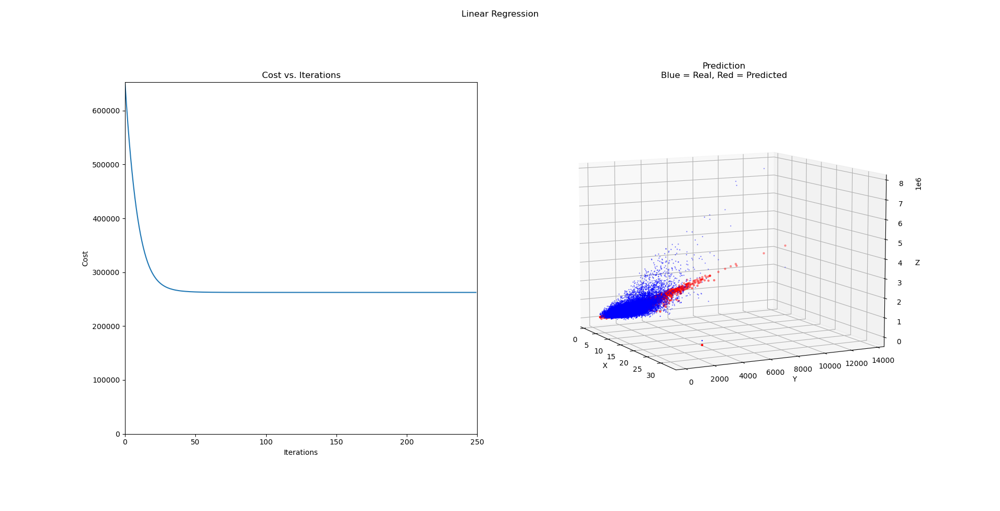

# linear-regression-from-scratch
This is an implementation of linear regression using only numpy (and matplotlib to plot from main).  
This model uses gradient descent to train.  
This implementation is pretty bare bones, lacking some features such as regulaization and polynomial terms.  
If I add regularization, I will add it to this repo, and if I add polynomial functionality, I'll make a new repo for that.  

# Example 
If you don't want to run it yourself, here's an example of what you can expect.  
However, there is much more to show than this if you tweak the code such as parameters and data.  
  

# To Run
* Have a working python environment with recent versions of numpy and matplotlib
* Download this repo and navigate to it in terminal
* Run "python main.py"
